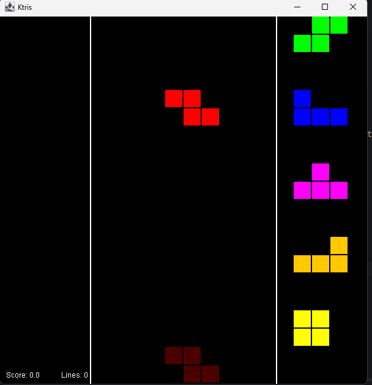

# Ktris

**Ktris** is a modular, headless Tetris engine written in Kotlin. It provides the core game logic, state management, and ruleset without enforcing a specific rendering or input implementation. This design allows it to be easily embedded into any Kotlin project, whether it's a desktop GUI application, a web app, or a server-side process.

## ✨ Features
*   **🕹️ Headless Core:** Pure game logic independent of any graphics or input framework.
*   **🧩 Modular Design:** Easily swap or extend rulesets, scoring systems, or piece behavior.
*   **📦 Clean State Management:** Simple interfaces for querying the game state and feeding inputs.
*   **🖥️ Platform Agnostic:** Use it with Java Swing/JavaFX, Compose Multiplatform, LibGDX, or even a terminal application.
*   **✅ Built-in Demo:** A simple, runnable Swing-based demo to see the engine in action.

## 🚀 Getting Started

### Prerequisites
*   **JDK:** Version 17 or higher.
*   **Git:** To clone the repository.

### Running the Demo
The project includes a simple Swing-based demo that provides a graphical user interface to interact with the Tetris engine.

1.  **Clone the repository:**
    ```bash
    git clone https://github.com/joao-fernandes-fra/Ktris.git
    
2. **Navigate to the project directory:**
    ```bash
    cd Ktris
3. **Run the demo **Using GRADLE:****
* on **macOS/Linux**
    ```bash
    ./gradlew runDemo
* on **Windows** 
    ```bash
    gradlew.bat run

A Swing window will open with a playable Tetris game. Use the keyboard controls to move and rotate the pieces.
### Demo Controls
*   **Rotate Cockwise:** X 
*   **Rotate CounterClockwise:** Z 
*   **Hold Piece:** C 
*   **Hard Drop:** Space 
*   **Soft Drop:** ↓ Arrow Key 
*   **Move Left:** ← Arrow Key 
*   **Move Right:** → Arrow Key 

## 📸 Screenshots & Demo



## 🛠️ Building and Editing
This project is built with **Gradle** (using the Kotlin DSL). The main code is located in `src/main/kotlin/`.

*   **To build the project:**
    ```bash
    ./gradlew build
## **Project Structure:**
* `src/main/kotlin/`: Contains the core engine code.
* `src/main/kotlin/demo/`: Contains the Swing-based demo application. This is a great place to see an example of how to interact with the engine.
* `build.gradle.kts`: The main Gradle build script.

## 🤝 Contributing
Contributions are welcome! If you'd like to contribute:

* Fork the repository.
* Create a new branch for your feature or bug fix.
* Make your changes.
* Submit a pull request.

## 📄 License
This project is licensed under the MIT License - see the [LICENSE](LICENSE) file for details.