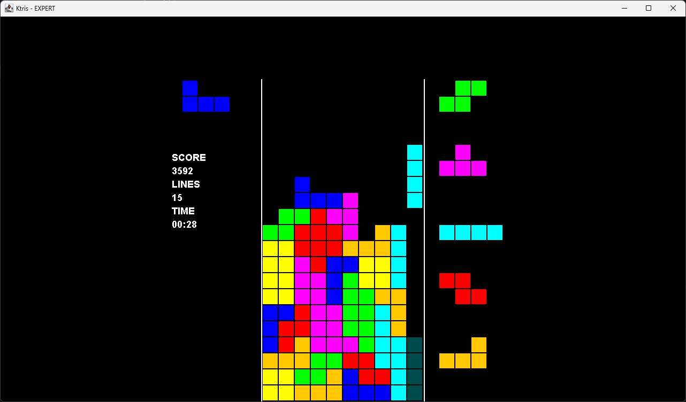
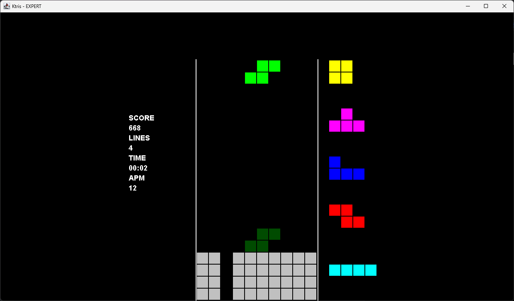
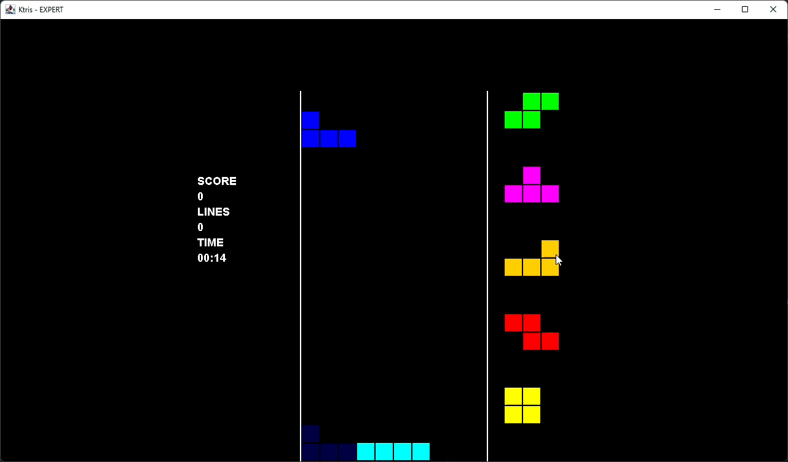

# Ktris

[](https://jitpack.io/#joao-fernandes-fra/Ktris)


**Ktris** is a modular, headless Tetris engine written in Kotlin. It provides the core game logic, state management, and ruleset without enforcing a specific rendering or input implementation. This design allows it to be easily embedded into any Kotlin project, whether it's a desktop GUI application, a web app, or a server-side process.

## ✨ Features
*   **🕹️ Headless Core:** Pure game logic independent of any graphics or input framework.
*   **🧩 Modular Design:** Easily swap or extend rulesets, scoring systems, or piece behavior.
*   **📦 Clean State Management:** Simple interfaces for querying the game state and feeding inputs.
*   **🖥️ Platform Agnostic:** Use it with Java Swing/JavaFX, Compose Multiplatform, LibGDX, or even a terminal application.
*   **✅ Built-in Demo:** A simple, runnable Swing-based demo to see the engine in action.

## 📦 Installation
To include Ktris in your project, add the JitPack repository to your build.gradle.kts file:

```kotlin
repositories {
    maven { url = uri("https://jitpack.io") }
}

dependencies {
    implementation("com.github.joao-fernandes-fra:Ktris:LATEST_TAG")
}
```

## 💻 Usage
Since **Ktris** is headless, the library manages the game rules, but you are responsible for the game loop, user input, and rendering. 
Interaction is handled by feeding commands to the GameEventBus and querying the current GameState.


## 🚀 Getting Started

### Prerequisites
*   **JDK:** Version 17 or higher.
*   **Git:** To clone the repository.

### Running the Demo
The project includes a simple Swing-based demo that provides a graphical user interface to interact with the Tetris engine.
#### Key features showcased in this demo
* **Guideline compliant:** This engine is built to the Tetris [guidelines](https://harddrop.com/wiki/Tetris_Guideline) to the best of my abilities, report if u find any issues with the code
* **Freeze Time Handling:** Toggle "Freeze Mode" to stop time and clear multiple rows at once.
* **Versus:** Try to survive for 2 minutes against a simulated enemy with configurable apm based on the difficulty setting
* **4-way:** Practice combos in a reduced size board

1.  **Clone the repository:**
    ```bash
    git clone https://github.com/joao-fernandes-fra/Ktris.git
    
2. **Navigate to the project directory:**
    ```bash
    cd Ktris
3. **Run the demo **Using GRADLE:****
* on **macOS/Linux**
    ```bash
    ./gradlew runDemo
* on **Windows** 
    ```bash
    .\gradlew.bat runDemo
* The demo have 3 built-in difficulties | Normal | Expert | Pro it can be specified in the arguments ex:`--args="expert"`
* Difficulties can be specified together with the game mode versus and/or 4way flag for a game ex:
    ```bash
    ./gradlew runDemo --args="expert versus 4way"

A Swing window will open with a playable Tetris game. Use the keyboard controls to move and rotate the pieces.
### Demo Controls
*   **Reset:** R
*   **Rotate Clockwise:** X 
*   **Rotate CounterClockwise:** Z 
*   **Hold Piece:** C 
*   **Freeze/Unfreeze:** S
*   **Hard Drop:** Space 
*   **Soft Drop:** ↓ Arrow Key 
*   **Move Left/Right:** ←/→ Arrow Key

## 📸 Screenshots & Demo


### Showcase engine ability to handle garbage lines ###


### Showcase engine ability to handle time freezes and board collapses ###

### Showcase customization with a 4wide board focused on combos ###


## 🛠️ Building and Editing
This project is built with **Gradle** (using the Kotlin DSL). The main code is located in `src/main/kotlin/`.

*   **To build the project:**
    ```bash
    ./gradlew build
## **Project Structure:**
* `src/main/kotlin/`: Contains the core engine code.
* `src/main/kotlin/demo/`: Contains the Swing-based demo application. This is a great place to see an example of how to interact with the engine.
* `build.gradle.kts`: The main Gradle build script.

## 🤝 Contributing
Contributions are welcome! If you'd like to contribute:

* Fork the repository.
* Create a new branch for your feature or bug fix.
* Make your changes.
* Submit a pull request.

## 📄 License
This project is licensed under the MIT License - see the [LICENSE](LICENSE) file for details.